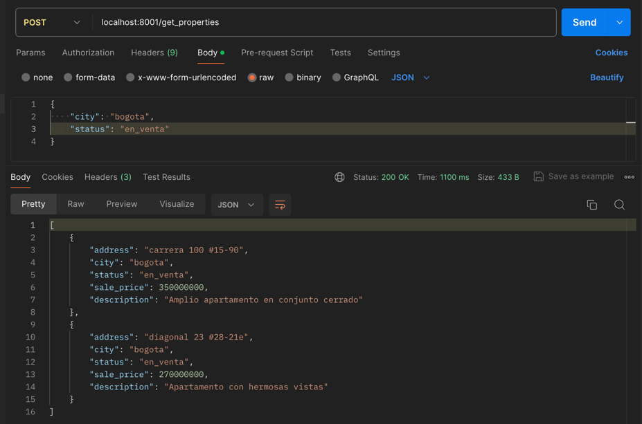
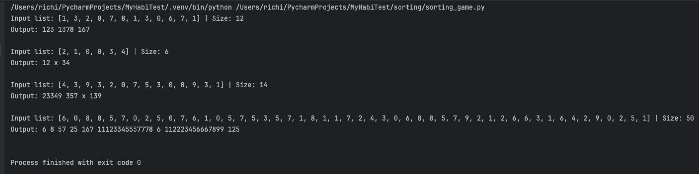

# My Habi's Ssr Dev test 🤖🏠

<hr>

## Introducción

**Nombre del dev: Ricardo Quintana**

**Cargo al que aspira: Ssr backend developer**

**Para que empresa: Habi**

Este repositorio tiene como objetivo entregar los resultados de las pruebas 
de desarrollo requeridas para continuar en el proceso de selección para el
cargo de Ssr backend developer en Habi. En su contenido, se encontrarán las
soluciones de ambos ejercicios planteados en el documento de prueba y 
organzados de la forma más orgánica posible para asemejar el posible 
repositorio de un proyecto real y común.

## Contenido

- [Introducción](#introducción)
- [Contenido](#contenido)
- [Ejercicio 1: Servicio de consultas y likes](#ejercicio-1-servicio-de-consultas-y-likes-)
  - [(a) Tecnologías y recursos para servicio de consultas](#a-tecnologías-y-recursos-para-servicio-de-consultas)
  - [(a) Instalación del proyecto del servicio de consultas](#a-instalación-del-proyecto-del-servicio-de-consultas)
  - [(a) Ejecución y uso del servicio de consultas](#a-ejecución-y-uso-del-servicio-de-consultas)
  - [(a) Pruebas unitarias](#a-pruebas-unitarias)
  - [(b) Propuesta de servicio para likes a propiedades, expansión de modelo de datos](#b-propuesta-de-servicio-para-likes-a-propiedades-expansión-de-modelo-de-datos)
  - [(c) Posibles puntos de mejora adicionales](#c-posibles-puntos-de-mejora-adicionales)
  - [(d) Dudas o stoppers encontrados y resueltos durante el desarrollo](#d-dudas-o-stoppers-encontrados-y-resueltos-durante-el-desarrollo)
- [Ejercicio 2: Sorting y agrupado de listas a.k.a "sorting game"](#ejercicio-2-sorting-y-agrupado-de-listas-aka-sorting-game-)
  - [Notas relevantes](#notas-relevantes)

## Ejercicio 1: Servicio de consultas y likes 🔍💜

A continuación se desarrollan los dos requerimientos de crear un servicio práctico para consultas de propiedades
y también el ejercicio de proposición de un modelo para gestionar un hipotetico servicio de "likes" de propiedades
para usuarios. El desarrollo de esta unidad se categorizará de la siguiente forma:

* (a) Desarrollo del ejercicio práctico de consultas de propiedades: Acá se abarca las tecnologías usadas, como
instalar el proyecto y por ultimo, como hacer su ejecución (**acá en este punto se encontrará el cuerpo JSON del request body a 
enviar junto a la petición al servicio**).
* (b) Desarrollo de la propuesta de implementación para likes a propiedades: En los items correspondientes a esta
categoría están la query para agregar la tabla necesaria y conectar el modelo actual con la tabla de usuarios ya 
existente en la base de datos, para poder extender el modelo y complementarlo con el desarrollo de un servicio de 
likes. También, está la imagen del modelo EERR propuesto en base a la query.
* (c) Extra! ..Como adicional, se propone una posible mejora al modelo de datos, para garantizar mejor la normalización
de su data y poder enriquecerla con algo de información mas que pueda servir para analítica y auditoría.
* (d) Dudas. Como se solicitó, cualquier duda se plantea acá y también se relata como fue abordado cada inconveniente
durante el desarrollo de este primer ejercicio de la prueba técnica.

### (a) Tecnologías y recursos para servicio de consultas

Para el desarrollo del ejercicio 1, para el desarrollo de microservicios se
utilizarán las siguientes tecnologías:

* *Git:* Indispensable para acceder al repositorio, clonarlo y en caso de ser necesario
interactuar con el.

* *Python v3.9.6:* Se escogió esta versión de Python para garantizar estabilidad
y mantenimiento a mediano/largo plazo para este desarrollo. Por el lado de Python,
este lenguaje es mandatorio para el desarrollo de esta prueba.

* *MySQL Server:* Engine de base de datos, mandatorio también para el desarrollo de
esta prueba.

* *mysq-connector-python:* Para el uso correcto de MySQL Server debemos usar
el conector nativo de MySQL para usar con Python.

* *dotenv.load_dotenv*: Este recurso built-in se utilizará para manejar las variables
de entorno del proyecto.

* *http.server:* Usaremos el módulo server de la librería built-in http para realizar
la configuración de un servidor que pueda recibir peticiones GET y POST para el
desarrollo de este ejercicio.

* *json:* Esta librería de Python la usaremos para manejar el request body a recibir
que contendrá (o no, si no se desea usar) los valores a filtrar en la base de datos.

* *requests:* Esta librería de Python la usaremos para las pruebas unitarias a desarrollar. 
Específicamente para el proceso de generar la conexión al API fixture y realizar las pruebas.

* *pytest:* Con pytest estructuraremos las pruebas a desarrollar para este componente 
(Nota: para el ejercicio 2 también se hicieron pruebas con pytest).

### (a) Instalación del proyecto del servicio de consultas

Por favor seguir las indicaciones de uso de este servicio para garantizar su correcto funcionamiento:

1. Posicionate en la carpeta donde deseas clonar el repositorio, o puedes crear una si no cuentas 
con algúna carpeta de proyectos Python, no existe inconveniente algúno.
2. Clona el repositorio: https://github.com/el-richi-97/MyHabiTest.git. Para este paso, debes contar con 
GIT instalado en el sistema.
3. Accede al interior de la carpeta "MyHabiTest" que obtienes al clonar el repositorio, para esto puedes
usar el comando: `cd MyHabiTest` o simplemente accediendo la carpeta desde la GUI de tu sistema.
4. Necesitas crear un entorno virtual. Con virtualenv puedes hacerlo así: `python -m venv mi-entorno`. 
Para esto, ya debes contar con Python instalado en tu equipo. Recomendación: Si es posible, abre tu IDE
de preferencia y usa la terminal desde el IDE, para hacer esta y las demás acciones directamente desde 
el proyecto abierto.
5. Luego de creado el entorno virtual se activa usando el comando en macOS/Linux: 
`source mi-entorno/bin/activate` o en Windows: `mi-entorno\Scripts\activate`. Si este queda activado
correctamente, verás que antes de la ruta en la consola, aparecerá entre paréntesis el nombre del entorno.
6. En bien el entorno virtual esté creado, es requerido instalar requerimientos, se hace con 
el comando: `pip install -r requirements.txt` dentro de la terminal
7. Es necesario instanciar las variables de entorno, se puede hacer creando un archivo llamado 
".env" en la raíz del proyecto y usar la siguiente estructura:

```
# DDBB env variables
HABI_SRC_HOST=<<host de ddbb>>
HABI_SRC_PORT=<<puerto de ddbb>>
HABI_SRC_USER=<<usuario de ddbb>>
HABI_SRC_PSSW=<<contraseña de ddbb>>
HABI_SRC_DDBB=<<esquema al que apuntar>>

# Service env variables
SERVICE_HOST=<<dirección donde montar el servicio, por defecto localhost>>
SERVICE_PORT=<<puerto donde montar el servicio, por defecto 8000>>
```


### (a) Ejecución y uso del servicio de consultas

Teniendo todo listo, la ejecución del proyecto se podrá hacer, posicionandose sobre la raíz del proyecto y usando 
el comando `python main.py`

tendremos que acceder a la URL formada por el host y port definidos en las variables de entorno y a la ruta asignada
para el consumo de la API. Para un ejemplo 
rápído: `http://localhost:8000/get_properties`. COMENTARIO ADICIONAL: Las pruebas de ejecución al momento del 
desarrollo, se realizaron por medio de postman.



Para el uso de los filtros, se debe usar el siguiente esquema de request body bajo formato JSON:

```json
{
    "year": 2021,
    "city": "bogota",
    "status": "en_venta"
}
```
Nota: en el proyecto se puede encontrar el archivo [request_body_filters_sample.json](request_body_filters_sample.json)
que contiene esta estructura de request body para las peticiones.

Tanto cada uno de los campos como la totalidad del request body son opcionales para el uso del servicio.

### (a) Pruebas unitarias
Las pruebas unitarias se realizaron con pytest, complementandose con request y threads para simular un entorno normal
de ejecución, con un fixture. Las pruebas realizadas fueron sencillas, más bien garantizando los status code esperados
y algunos otros comportamientos tales como que se contenga parte de la base de un mensaje de error con un uso 
incorrecto de la API, que el contenido de una busqueda sin resultados sea exitoso pero venga vacío o que una consulta
que deba retornar resultados si contenga data en su response body.

Las pruebas se pueden encontrar en [tests/test_habi_properties_query.py](tests/test_habi_properties_query.py). Estas
fueron ejecutadas inicialmente mediante las herramientas del IDE de desarrollo usado y también bajo consola.

<hr>

### (b) Propuesta de servicio para likes a propiedades, expansión de modelo de datos

Para la implementación de un modelo de interacción de usuarios con propiedades a base de likes se plantean
las siguientes casuísticas:

1. Teniendo en cuenta que la base de datos posee un esquema de datos por default de Django, para reducir 
tiempos de desarrollo podríamos asumir que la tabla auth_user será viable para la gestión de usuarios del
aplicativo, entonces se usará dicha tabla como está.
2. Un usuario como en cualquier plataforma, podrá darle like a un elemento (en este caso, inmuebe) pero puede
arrepentirse de hacerlo y quitar el like. Para ello, tendremos el campo de active_like que por defecto siempre
se guardará en True, pero cuando el usuario revierta sus cambios en vez de erradicar el registro haremos
un "soft delete" desactivando dicho registro, cosa que mantendrá la información en BBDD y a futuro este tipo
de situaciones podrían servir de analítica para mirar que es lo que puede motivar a los usuarios a cambiar de
parecer respecto al interés en una vivienda, podría ser una oportunidad de mejora.
3. Siguiendo esa linea, tenemos dos campos de tipo timestamp/datetime que nos ayudarán a llevar la 
trazabilidad de dichas acciones del usuario, uno registrará la fecha en que se haya creado la interacción (like)
con una propiedad, el otro campo nos dirá en que fecha el usuario cambió su decisión respecto a la propiedad.
4. Al final con estas tablas adicionales al modelo (ya que auth-user no estaba directamente relacionada con el modelo) 
tendremos un modelo de datos en copo de nieve, lo cual sería una estructura óptima para el desarrollo
de consultas al modelo y garantizar un rendimiento acorde a las necesidades de una solución de segumiento
de usuarios y sus interacciones con las propiedades.

El query SQL para realizar la creación de esta nueva tabla, y relacionarla con auth-user y con property es el siguiente:

```mysql
CREATE TABLE user_properties_likes (
    
    -- Generamos los campos para nuestra tabla de likes de usuarios a propiedades
    id INT AUTO_INCREMENT NOT NULL ,
    like_date TIMESTAMP DEFAULT current_timestamp,
    update_like_date TIMESTAMP DEFAULT current_timestamp ON UPDATE current_timestamp,
    active_like BOOL DEFAULT TRUE NOT NULL,
    user_id INT NOT NULL,
    property_id INT NOT NULL,
  
    -- Declaramos las restricciones de campos para llave primaria y foráneas de la tabla
    CONSTRAINT user_properties_likes_pk PRIMARY KEY (id),
    CONSTRAINT user_properties_likes_auth_user_id_fk
        FOREIGN KEY (user_id) REFERENCES auth_user (id),
    CONSTRAINT user_properties_likes_property_id_fk
        FOREIGN KEY (property_id) REFERENCES property (id)
);
```

Ahora, el modelo entidad relación para esta implementación sería el siguiente:


<hr>

### (c) Posibles puntos de mejora adicionales

Sugiero que a este diagrama se le añadan ciertas tablas y campos más de información con el fin de poder
realizar una mejor normalización de datos y gestión de auditoría de la información. El detalle de estos
puntos de mejora son los siguientes:

1. Intentar normalizar la información de ubicaciones por medio de tabla externa de ciudades u otras
geografias. Asumiendo que, lo que hay en tabla de bases de datos son registros de texto que pueden ser
sensibles a cambios (ejemplo: la posibilidad de algún momento encontrar "bogota" y "bogotA" o "bogotá").
2. Campos de auditoría en tabla property (fecha de creación y eliminaación), de esto se podría rastrear mejor los cambios de información y 
esto podria ayudar a mejorar el seguimiento de viviendas. La ventaja es que este tipo de campos se pueden instanciar
de forma automática en la base de datos por medio de triggers o porcedimientos almacenados, ahorrando este tipo de tareas
para que el back no tenga que intervenir del todo.
3. Cambiar nombres de campos como el de update_date en la tabla de status_history para tener mas claridad
en la información, una alternativa buena podría ser "status_change_date".
4. Otro punto importante a revisar es respecto a la integridad de los campos, con tanta llave foránea toca analizar bien
las logicas a contemplar a la hora de que un registro foráneo desaparezca. Control entre los ON DELETE CASCADE y los 
ON DELETE SET NULL para evitar falencias con la data.

El diagrama resultante con estas pequeñas modificaciones sería el siguiente:


<hr>

### (d) Dudas o stoppers encontrados y resueltos durante el desarrollo

Durante el desarrollo de este ejercicio se presentaron algunas dudas y circunstancias
que fueron resueltas durante el mismo lapso de desarrollo de la prueba, las situaciones
presentadas y sus respectivas soluciones fueron las siguientes:

* ¿Como realizar pruebas unitarias para una implementación bajo http.server?
  * **Respuesta:** Dado que llevaba buen tiempo sin hacer una implementación de APIs sin 
  soporte de frameworks (debido a que me he especializado en usar Django o FastAPI) 
  me encontré en la situación de no saber si priorizar pruebas mockeando server para
  dicho acometido o si aislar el componente lógico del método para realizar las pruebas
  unitarias. Entonces, se decide implementar un servidor de pruebas por medio de threading 
  para poder realizar las pruebas de forma aislada a una ejecución normal del servidor.
  Además, se hacen 3 casos de prueba sencillos acorde al ejercicio realizado, todo con 
  pytest y a nivel de testear el endpoint bajo un servidor fixture.
  
* ¿Talvez hacer mas sencillo el uso de variables de entorno?
  * **Respuesta:** Al trabajar con data sensible como una base de datos lo ideal siempre
  será ocultar esta información sensible e implementarla por medio de variables de entorno,
  pero para facilitar la labor de tener que guardarlas en un sistema por medio de la 
  terminal (cosa que dependiendo del usuario puede ser complicado) he decidido implementar
  la librería "dotenv" de python para simplemente almacenar dichas variables en un
  archivo .env que quedará en la raíz del proyecto y donde de forma sencilla cualquier
  usuario colocará las variables de entorno requeridas para la conexión a base de datos
  que requiere este proyecto.

* ¿Como garantizar la funcionalidad de filtros dinámicos en una consulta SQL sin ORM y 
cuidando la integridad de los tipos de datos de dichos filtros?
  * **Respuesta:** Plantié en app/habi_properties_query/utils/queries.py un método con el
  cual el request body que el usuario enviará, será convertido en una secuencia de strings
  concatenados (siempre y cuando se hayan indicado esos campos o se les haya dado valor) 
  y que cumplan las condiciones necesarias para ser insertadas como una clausula WHERE
  en la consulta a realizar. Además, la data, tipo de dato y nombres de campos se 
  colocaron a modo de placeholders para darle más seguridad a la consulta y sobretodo
  cuidar los tipos de datos e información a mandar a la consulta.

* ¿La consulta deseada como se hizo?
  * **Respuesta:** Duré varios minutos planteando como hacer esta query para que no solo
  diera el resultado esperado sino que también fuera lo más optimo posible. Teniendo en 
  cuenta que tenía que partir desde una tabla y hacer JOIN con las otras dos para poder
  filtrar como se deseaba, decidí hacer una consulta adicional para acotar la información
  de los estados más recientes por tabla y esa subconsulta la agregué como un JOIN adicional
  para reducir de una vez y antes de llegar a la clausula WERE todos los estados de propieddes
  que fueran los más recientes por cada propiedad. Esto se hace generando la consulta y agrupando
  los id_propiedad por el máximo valor existente de fecha de actualización de la tabla de 
  historial de estados. Comparando con otras dos versiones más de esta consulta, la implementada
  fue por segundos más eficiente.

* Había data inconsistente en la tabla de propiedades ¿Como se descartó?
  * **Respuesta:** Siguiendo las pautas del modelo de negocio de Habi, propiedades con información
  nula o vacía de precios de venta es redundante porque para Habi no hay interés en mostrar
  inmuebles con "precio en cero" por descarte no traerían beneficio sino inclusive inconvenientes
  con los clientes. Por ende, se agregó internamente un filtro permanente para garantizar que siempre
  venga información con precios reales, que es lo que le importa tanto a Habi como al cliente.

<hr>

## Ejercicio 2: Sorting y agrupado de listas a.k.a "sorting game" 🎲

Bauticé mi desarrollo de este ejercicio como sorting game, ya que no tenía nombre concreto en el documento de la prueba.
El desarrollo de este ejercicio planteando primero una solución y luego de ver que se podía mejorar (porque el archivo
es entendible, pero se nota que podia tratar de mejorarse) no reemplacé la función realizada sino que propuse la primera
versión y una nueva, como para mirar alternativas de desarrollo y sobretodo, demostrar como puede evolucionar una 
implementación de software.

### Notas relevantes
Destaco las siguientes notas del desarrollo de esta solución:

* La implementación de esta solución está en [sorting/sorting_game.py](sorting/sorting_game.py).
* Se hicieron pruebas unitarias, están en [tests/test_sorting_game.py](tests/test_sorting_game.py).
* El detalle de como funcionan los métodos y el proceso realizado, se encuentra en la documentación de cada método
en el archivo .py del desarrollo. Además, explico también el "por que" de un método v2.
* El ejercicio y las pruebas se hicieron en base a las propias listas y resultados planteados en el documento.
* Además, plantié una lista más para probar, distintas a las de ejemplo e hice también una lista aleatoria grande
para probar ambos métodos diseñados.
* Las pruebas si las hice unicamente basandome en las listas y resultados del documento, probando ambos métodos.

No era necesario pero adjunto una imágen de una ejecución directa del archivo sorting_game.py:


